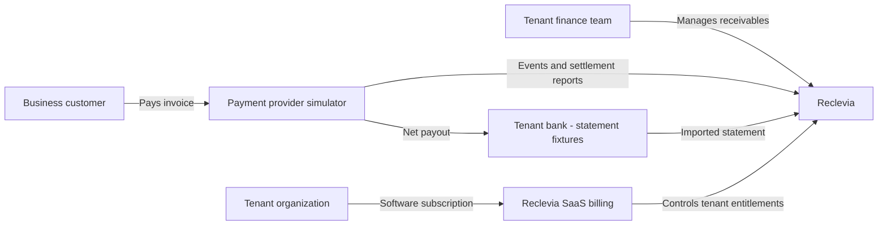
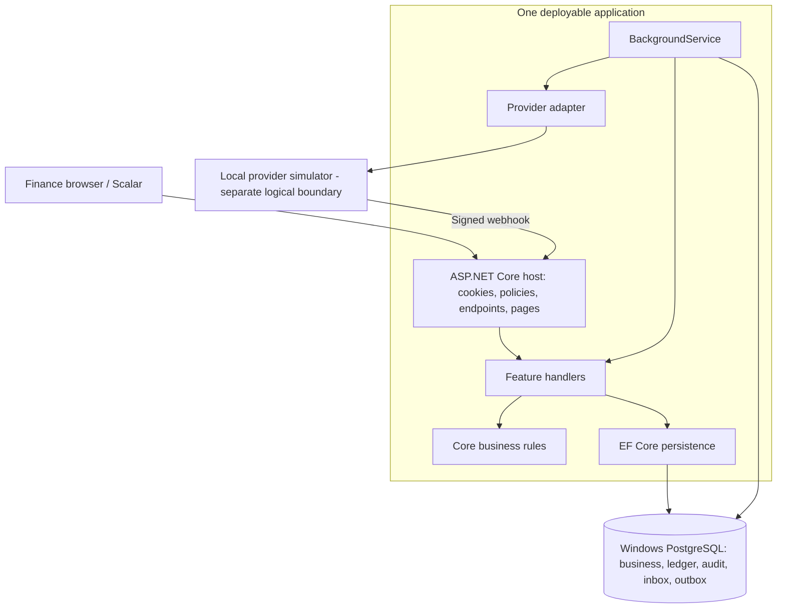
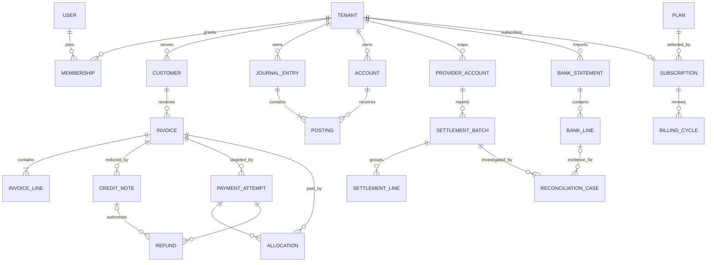
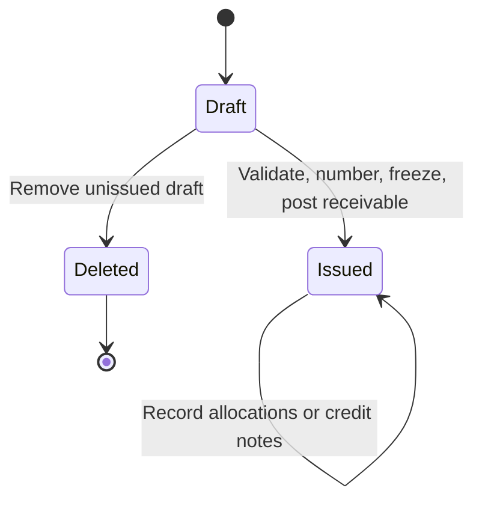
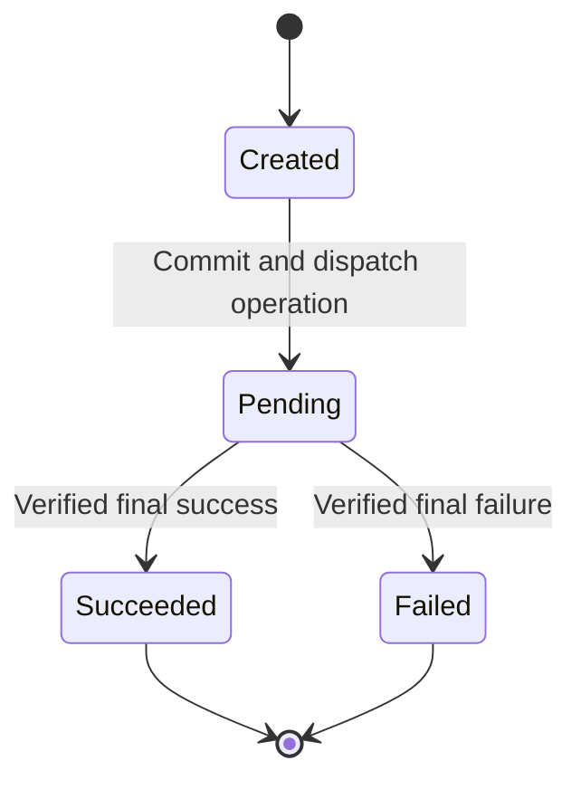
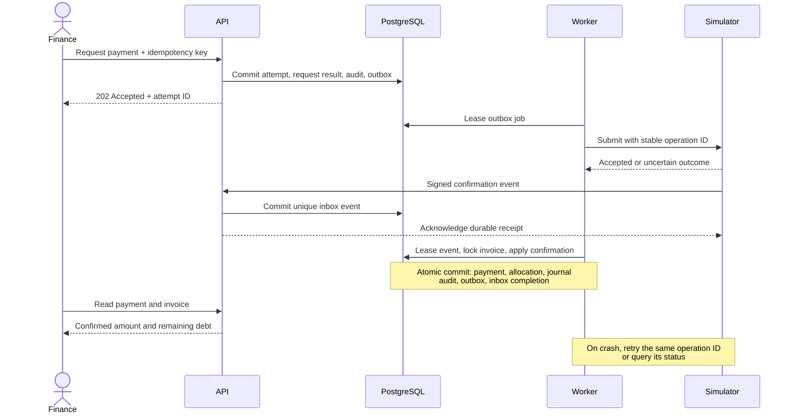
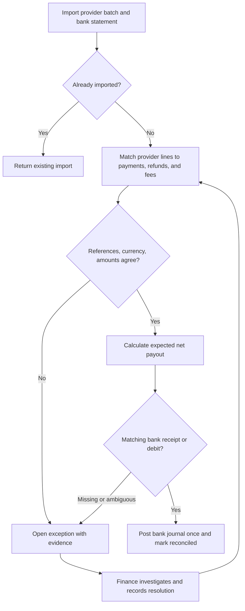
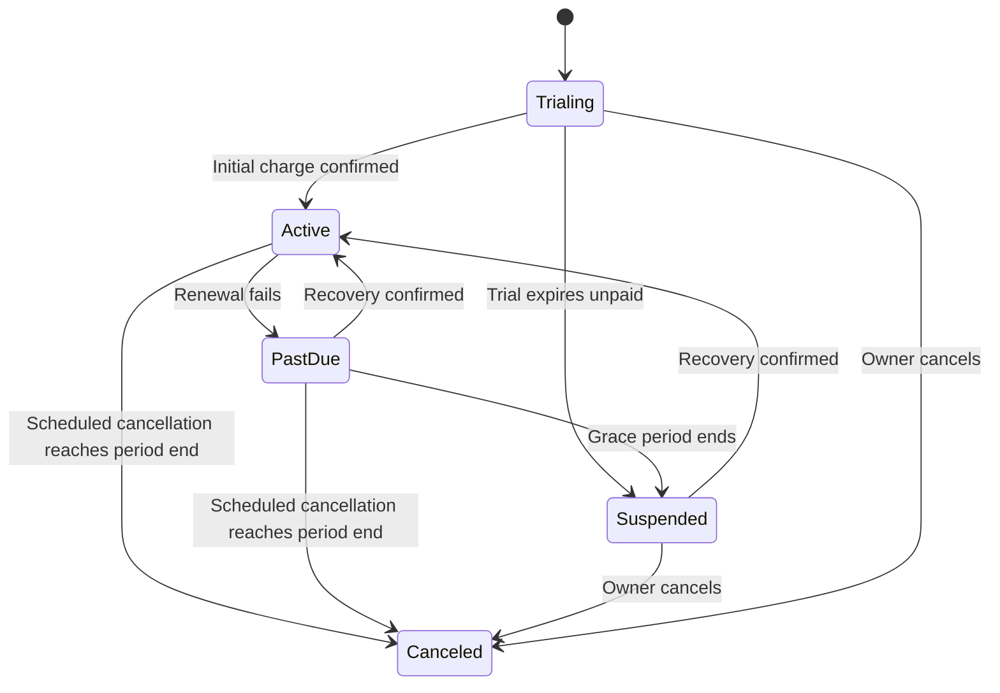

# Diagrams

These are planned designs. GitHub renders the Mermaid blocks. The repository tree in ARCHITECTURE is the folder diagram.

## 1. Business context

## 2. Application and dependencies

## 3. Core data relationships

Conceptual model: routine columns and support tables are omitted. Every tenant-owned relationship includes TenantId. Allocations retain release history for credits; journal sources link to their originating records.

## 4. Invoice state and calculated views

Issued is the document state. **Open, partially paid, paid, credited, and overdue are calculated views** of its amounts and dates, not a second mutable state machine. A fully paid invoice stays issued after a refund; the credit note and refund explain the correction.

## 5. Payment attempt state

Timeouts and unresolved provider status leave an attempt Pending. A new attempt after confirmed failure is a new operation. Refunds have their own Pending/Succeeded/Failed records; they never rewrite a successful payment. Contradictory events require provider lookup or an exception, not blind state changes.

## 6. Payment execution and crash recovery

## 7. Reconciliation decisions

## 8. SaaS lifecycle

Successful renewal keeps the subscription Active. Before a scheduled cancellation takes effect, current access remains. Canceled tenants may start a new billing period through an explicit reactivation flow. Collection and reconciliation of existing financial obligations continue in every subscription state.
